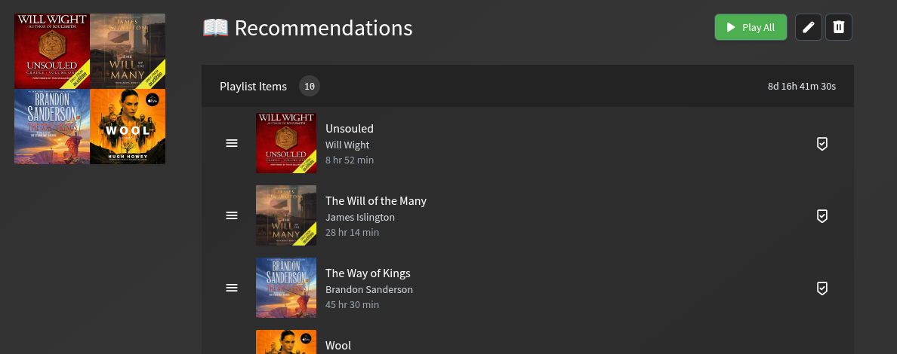

# Audiobookshelf AI Recommender

An intelligent n8n workflow that analyzes your Audiobookshelf library and listening habits to generate personalized audiobook recommendations. It uses a Large Language Model (LLM) to understand your preferences based on your rated playlists and suggests unread books while respecting series order.

## 🚀 Overview

This workflow automates the discovery of new audiobooks. Instead of relying on generic algorithms, it looks at:

1. **Your Ratings:** It interprets your existing playlists (e.g., those named "⭐" through "⭐⭐⭐⭐⭐") as explicit ratings for books.
2. **Your Progress:** It identifies which books you have already started or finished to avoid redundant suggestions.
3. **Your Library:** It analyzes the metadata (authors, genres, series) of your entire collection.
4. **Series Logic:** It ensures it doesn't recommend a sequel unless you've completed the preceding books in that series.

The final result is a dynamically updated playlist in your Audiobookshelf instance named **"📖 Recommendations"**.

## 📋 Prerequisites

To run this workflow successfully, you need:

1. **Audiobookshelf Instance:**
    * A running Audiobookshelf server.
    * An API Key with appropriate permissions.
    * The `Library ID` of the library you wish to scan.
    * **Rating Playlists:** To provide theAI with your preferences, you must create playlists in Audiobookshelf named with stars (e.g., `⭐`, `⭐⭐`, `⭐⭐⭐`, `⭐⭐⭐⭐`, `⭐⭐⭐⭐⭐`) and add books to them to represent how much you liked them.
2. **n8n Instance:**
    * A running n8n environment.
    * **Credentials:** You must create an n8n **Header Auth** credential to connect to Audiobookshelf.
        * **Header Name:** `Authorization`
        * **Header Value:** `Bearer <your_api_key>`
3. **LLM Backend:**
    * The workflow is currently configured to use a local `llama.cpp` instance (via the OpenAI node) running the `gemma-4-26B-A4B-it-UD-IQ4_XS.gguf` model.
    * *Note: You may need to update the credentials and model ID in the "Audiobook Recommendation Engine" node if using a different provider (like OpenAI, Anthropic, or a different local model).*
4. **Workflow Configuration:**
    * Update the **"Inject Secrets"** node with your specific `baseUrl`, `libraryId`, and `recommendationCount`.

## ✨ Expectations

After running the workflow (manually or via weekly schedule):

* **New Playlist:** A playlist titled **"📖 Recommendations"** will appear in your Audiobookshelf library.
* **Curated Content:** The playlist will contain a list of unread audiobooks (up to the count specified in "Inject Secrets") that match your taste.
* **Automatic Updates:** The workflow is set to run weekly, automatically deleting the old recommendation playlist and creating a fresh one.

## 🛠️ Workflow Design

The workflow is designed as a multi-stage pipeline:

### 1. Data Ingestion & Categorization

* **Secret Injection:** Loads configuration.
* **Parallel Fetching:** Simultaneously retrieves your playlists, full library items, and user media progress.
* **Playlist Parsing:** Uses a `Code` node to categorize playlists based on their name (e.g., "⭐⭐" becomes a 2-star rating).

### 2. Preference Modeling

* **Read/Rated Mapping:** Combines the parsed playlists to create a dataset of "Books I have read and how much I liked them."
* **Unread Identification:** Compares the full library against your "media progress" to isolate books you haven't touched yet.
* **Data Reduction:** A specialized Code node transforms the heavy library metadata into a lightweight, text-efficient summary. This minimizes LLM token usage and focuses only on what matters: Title, Author, Series, and Rating.

### 3. AI Reasoning

* **Recommendation Engine:** The summarized data is sent to the LLM. The prompt instructs the AI to:
  * Identify patterns in your preferred authors, genres, and themes.
  * Recommend only unread books.
  * Strictly adhere to series order (no "Book 2" if "Book 1" is unread).
  * Output a clean JSON object.

### 4. Playlist Management (Idempotency)

* **State Check:** The workflow checks if a "📖 Recommendations" playlist already exists.
* **Cleanup:** If it exists, the old playlist is deleted to prevent duplicates.
* **Deployment:** The new recommendations are parsed and sent to the Audiobookshelf API to create the new playlist.
